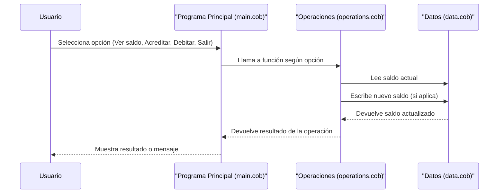

# Documentación del Sistema de Cuentas de Estudiantes (COBOL)

Este documento describe el propósito de cada archivo COBOL en el sistema de gestión de cuentas de estudiantes de la escuela, sus funciones clave y las reglas de negocio implementadas.

## Propósito de los archivos COBOL

### [`src/cobol/main.cob`](../src/cobol/main.cob)
- **Propósito:** Actúa como el programa principal y la interfaz de usuario del sistema.
- **Funciones clave:**
  - Muestra un menú con opciones para ver el saldo, acreditar, debitar o salir.
  - Recibe la opción del usuario y llama a los procedimientos correspondientes en [`src/cobol/operations.cob`](../src/cobol/operations.cob).
  - Controla el ciclo principal del programa hasta que el usuario decide salir.
- **Reglas de negocio:**
  - Solo permite opciones válidas (1-4).
  - Finaliza el programa cuando el usuario selecciona "Salir".

### [`src/cobol/operations.cob`](../src/cobol/operations.cob)
- **Propósito:** Gestiona las operaciones sobre la cuenta del estudiante.
- **Funciones clave:**
  - Procesa operaciones de consulta de saldo, crédito y débito.
  - Solicita al usuario el monto para acreditar o debitar.
  - Llama a [`src/cobol/data.cob`](../src/cobol/data.cob) para leer o actualizar el saldo.
  - Valida que el saldo sea suficiente antes de permitir un débito.
- **Reglas de negocio:**
  - No permite debitar más del saldo disponible.
  - Actualiza el saldo después de cada operación exitosa.
  - Informa al usuario si los fondos son insuficientes para un débito.

### [`src/cobol/data.cob`](../src/cobol/data.cob)
- **Propósito:** Encapsula el almacenamiento y manipulación del saldo de la cuenta.
- **Funciones clave:**
  - Proporciona operaciones para leer y escribir el saldo.
  - Mantiene el saldo actual en memoria.
- **Reglas de negocio:**
  - Inicializa el saldo en 1000.00 al inicio del programa.
  - Solo permite modificar el saldo a través de operaciones controladas.

## Reglas de negocio generales

- El saldo inicial de cada cuenta es de 1000.00.
- Solo se pueden realizar débitos si hay fondos suficientes.
- Todas las operaciones deben pasar por los módulos definidos para mantener la integridad de los datos.

---

## Diagrama de secuencia del flujo de datos

